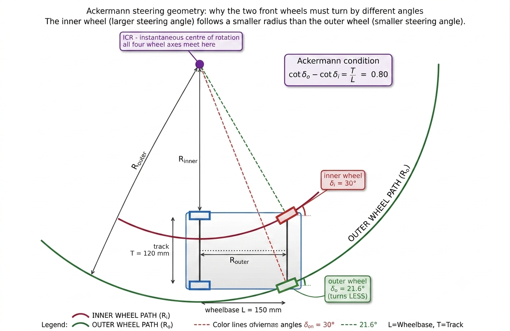
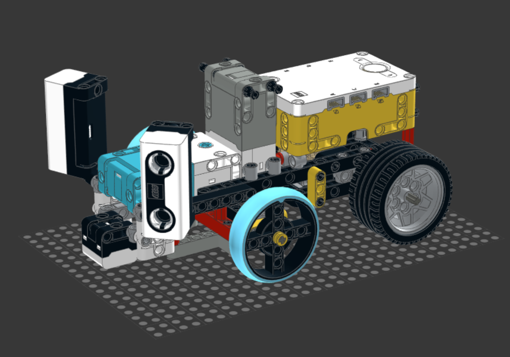

# Name_WRO_FE_2026
## WRO Future Engineers - Robotics Project Documentation
## HELLO WE ARE TEAM FAST FIVE

### Our team
| Photo | Member Name     | Role & Experience |
| ----- | --------------- | ----------------- |
|| Nguyễn Tự Tuyển | ...               |
| ...   | Hoàng Đức Quân  | ...               |

## Table of Contents
- [1. Overview](#1-overview)
  - [1.1 About the Project](#11-about-the-project)
  - [1.2 Robot Images](#12-robot-images)
  - [1.3 Repository Content](#13-repository-content)
- [2. Mobility Management](#2-mobility-management)
  - [2.1 Drive System](#21-drive-system)
  - [2.2 Steering](#22-steering)
  - [2.3 Chassis Design](#23-chassis-design)
- [3. Power and Sense Management](#3-power-and-sense-management)
  - [3.1 Power Source](#31-power-source)
  - [3.2 Sensors and Camera](#32-sensors-and-camera)
  - [3.3 Processing Units](#33-processing-units)
  - [3.4 Port / Wiring Map](#34-port--wiring-map)
  - [3.5 Power Consumption](#35-power-consumption)
- [4. Obstacle Management](#4-obstacle-management)
  - [4.1 Open Challenge](#41-open-challenge)
  - [4.2 Obstacle Challenge](#42-obstacle-challenge)
  - [4.3 Parallel Parking](#43-parallel-parking)
- [5. Source Code](#5-source-code)
  - [5.1 Code Overview](#51-code-overview)
  - [5.2 Code Structure](#52-code-structure)
  - [5.3 Upload / Run Instructions](#53-upload--run-instructions)
- [6. List of Components](#6-list-of-components)
- [7. 3D Model Files](#7-3d-model-files)
- [8. Building Instructions](#8-building-instructions)

---

## 1. Overview

### 1.1 About the Project

This project of ours is a self‑driving car for the WRO Future Engineers category. The car's a vehicle that can finish the Open Challenge, which asks for three laps on a random track without touching a wall. The car can also complete the Obstacle Challenge, which requires three laps while reading green traffic signs and then doing parallel parking. 

This is the year our team has competed in this category, so much of the project involved learning engineering and programming skills from scratch.

Our robot is built on a custom LEGO Technic + 3D-printed (PLA) chassis, in a rear-wheel differential-drive, Ackermann front-steer configuration, controlled by a LEGO® Education SPIKE™ Prime Hub and a Matrix Robotics M-Vision Cam for onboard image processing. Design priorities, in order, were: a low center of gravity for stability, a lightweight structure to reduce motor strain, and a minimal footprint for maneuverability.

### 1.2 Robot Images

### 1.3 Repository Content
| Folder | Content |
| ------ | ------- |
| [t-photos](t-photos) | photo of team members |
| [v-photos](v-photos) | photos of the vehicle, including view from all 6 directions |
| [source code](source-code) | python source code for the vehicle's camera and controller |
| [schemes](schemes) | diagrams used |
| [Model](model) | Photo of component models and 3D model for ultra_adapter and cam_holder |

---

## 2. Mobility management
Design objective: Our chassis is built around 3 goals: stability (keep a low, balanced center of gravity so the robot doesn’t tip or wobble to the side during hard turns or sudden acceleration, and a steady drive base for the camera), efficiency (a lightweight structure so the drive motor isn't fighting excess mass), and maneuverability (a compact footprint that can navigate tight corners and obstacles without sacrificing control).
Motor: LEGO® Technic™ Large Angular Motor (drives the rear differential)
### 2.1 Drive System


Specifications
* Connector: LEGO® Power Functions 2.0 (LPF2)
* Voltage range: 5–9V (SPIKE Hub nominal: 7.2V)
* No-load speed: ~175 RPM (team measurement, vs ~135 RPM for the stock SPIKE-branded Large Angular Motor)
* Feedback: integrated rotation/position sensor|

Reason for Selection

Higher RPM than the stock SPIKE motor, for faster lap times on the flat competition arena.
Smaller footprint with more mounting-hole positions on the case, giving flexibility in where it sits on the chassis.
Built-in rotation sensor gives closed-loop feedback for encoder-based distance/angle control.

### 2.2 Steering
Motor: LEGO® Technic™ Large Angular Motor + 1:1 gearbox


Specifications
* Connector: LPF2
* Voltage range: 5–9V
* Stall torque: ~40 N·cm with the 1:1 gearbox (team measurement, vs ~25 N·cm for the stock SPIKE Angular Motor)
* Feedback: integrated rotation/position sensor, used for heading/angle-based turns (`MotorB_Angle`)
* Reason for Selection :Highest available stall torque among LEGO Powered Up motors, needed to move the Ackermann linkage under load.
Position feedback lets steering angle be driven and held precisely rather than open-loop.



Ackermann steering:
When a car turns, the inner and outer front wheels trace circles of different radii, so they need to point at different angles. The inner wheel turns sharper than the outer one. Our steering linkage approximates this relationship so all four wheels roll cleanly with minimal sideways scrubbing, which improves turning accuracy and cuts down on friction losses. 

Why does this happen geometrically?
For a vehicle to corner without any wheel sliding sideways, every wheel has to travel along a circular arc, and all of those arcs must share one common center point: the instantaneous center of rotation (ICR). A wheel only rolls cleanly when its axle points directly at that center. Because our rear axle is fixed, both rear wheels share the same axis line, which pins the ICR somewhere along the extension of that line. The two front wheels then have to angle themselves so their own axle lines also converge on that same point and since the inner front wheel is physically closer to the ICR, it has to turn through a tighter circle, meaning a larger steering angle than the outer wheel. 

The math behind it: for wheelbase L, track width T, and inner/outer steering angles δᵢ and δₒ, the condition that keeps both front axle lines meeting the rear axle line at one point works out to:
cot(δₒ) − cot(δᵢ) = T / L
This relationship isn't linear; the required gap between the two angles grows a lot faster than the angles themselves. At a shallow ~10° steering input the difference between inner and outer angle is only about 1°, but near full lock (~30°) that gap widens to 8° or more. If we'd built a rigid linkage that just kept both wheels parallel, it would look almost correct while driving straight or gently curving, and be badly wrong exactly when precision matters most: sharp corners or a parking maneuver.

Wheels: 49.5 mm SPIKE wheels (front)

Small diameter for agility and quick direction changes at the steered wheels.

Considerations

Even with the 1:1 gearbox, torque at the steering linkage was tighter than expected after the first v2 build - a candidate area to revisit (e.g. a different gear ratio or linkage geometry) if we find the robot under-steering at speed.
### 2.3 Chassis Design



Main chassis: LEGO SPIKE Prime Hub, drive and steering motors, ultrasonic sensors, line sensor, structural connectors, and wheel assemblies. 
Rear camera assembly: A structure to hold the Matrix Camera M-Vision AI Cam. 

Why We Put the Camera to the Rear: 
Raising the camera and pushing it toward the rear gives the vision system a much wider field of view, which lets the robot spot the wall and obstacles earlier and more consistently. The trade-off is that a tall mast sitting up high introduces a real risk of tipping the robot, so we had to design the robot so it doesn't tip or wobble to the side during hard turns or sudden acceleration.

Keeping the Elevated Camera From Tipping the Robot: 
To make sure the taller rear mast wouldn't make the robot unstable, we ran a basic static-moment analysis using the rear wheels' contact line with the ground as the pivot point. We compared two moments: 
M₁ - the restoring moment from the main chassis (its mass × its distance from the pivot)
M₂ - the overturning moment from the rear mast/counterweight assembly (its mass × its distance from the pivot)
The robot will stay upright as long as M₁ ≥ M₂, i.e., as long as the main chassis's moment is greater than or equal to the rear assembly's moment. 

Since the main chassis's mass and position are essentially locked in (the hub, motors, and sensors don't move), the only variable we could actually control was the rear assembly. So we minimized both its mass and its distance from the pivot: the camera mount itself, which accounts for most of the rear assembly's weight, sits as close to the pivot as the design allows.


## 3. Power and Sense Management

### 3.1 Power Source

**Battery:** SPIKE Prime rechargeable Li-ion Hub Battery

**Specifications**
- Type: rechargeable lithium-ion, charged in-hub via micro-USB
- Capacity: ~2,000–2,100 mAh (per LEGO Education spare-part listings)
- Working range used in our firmware: 6,900–8,300 mV (see `Battery()` in §5), consistent with a 2-cell Li-ion pack

| Component | Voltage | Current (typical) | Current (peak) | Power (typical) |
|---|---|---|---|---|
| Hub | 7.2 V | 1.0 A | 1.5 A | 7.2 W |
| Camera | 5 V | 0.15 A | 0.3 A | 0.75 W |
| Ultrasonic ×2 | 5 V | 0.04 A | 0.06 A | 0.2 W |
| Drive motors ×2 | 7.2 V | 1.0 A | 2 A | 7.2 W |
| **Total** | | **2.19 A** | **3.86 A** | **15.35 W** |

The battery powers the SPIKE Prime Hub directly; the Hub in turn supplies all motors and sensors over their LPF2 leads, and the M-Vision Cam over its dedicated 5V cable - no separate step-up/step-down conversion is needed anywhere in the system, since the camera's 5V input matches the Hub's output.

Our firmware reads `hub.battery.voltage()`, clamps it to the 6,900–8,300 mV working range, and converts it to a 0–100% estimate so we can catch a low-charge robot before a run.

**Considerations**

Because everything runs off one Hub battery with no separate motor supply, our power architecture is much simpler than a Raspberry Pi-class system (no MOSFET power-switching, no DC-DC boost converter, no separate motor driver IC) - the tradeoff is that we're bound to whatever voltage/current the Hub itself can deliver.
### 3.2 Sensors and Camera
| Sensor | Model | Qty | Purpose |
|---|---|---|---|
| Camera | Matrix Robotics M-Vision Cam (Type-C) | 1 | Lane/sign detection, corner detection |
| Ultrasonic | LEGO SPIKE Prime Ultrasonic Sensor | 2 | Left/right wall distance |
| IMU | Built into SPIKE Prime Hub | 1 | Angular velocity for heading estimation |
| Motor encoders | Built into SPIKE Prime motor | 2 | Distance measurement, steering calibration |
| Color/line sensor | SPIKE Prime color/distance sensor | 1 | Corner line (color) detection |

### Why each sensor was chosen

**Camera: Matrix Robotics M-Vision Cam (Type-C cable pack)**

*Specifications*
- Processor: STM32H7, 480 MHz
- Interface: UART over LPF2 to the SPIKE Prime Hub
- Operating voltage: 5V (matches Hub output directly)
- Color space: LAB (in addition to RGB/HSV)

*Reason for Selection*
- Has its own onboard processor, so the Hub doesn't have to run image-processing algorithms itself — this saves battery and keeps the Hub's CPU free for motor/sensor control.
- Supports LAB color space, which separates brightness (L) from color (A/B). Since the A/B axes stay comparatively stable when the arena's lighting shifts brighter or darker, LAB gives more consistent line/color detection than RGB or HSV under variable lighting.

*Tasks:* line following and wall-fill detection (Open Challenge); red/green traffic-sign blob detection, magenta parking-wall detection, and lap-boundary color detection (Obstacle Challenge).

**Distance sensing: 2× LEGO® Technic™ Distance Sensor (ultrasonic)**

*Specifications (manufacturer)*
- Sensing technology: ultrasonic
- Range: 50–2,000 mm (fast-sensing mode: 50–300 mm)
- Accuracy: ±1 cm
- Extras: 4-segment programmable LED "eyes"; detachable LPF2 breakout on the rear

*Tasks:* one sensor on each side reads distance to the left/right walls. At the start of a run, this tells the robot whether the course is Clockwise or Counterclockwise (by checking which side has a wall); during a run, it feeds `Ultra_err()`/`Ultra_steer()` to hold a consistent stand-off from the wall and correct heading error.

**Ground sensing: LEGO® Technic™ Color Sensor**

*Specifications (manufacturer)*
- Detects 8 discrete colors, plus RGB/HSV values
- Measures reflected light intensity (for line-following) and ambient light
- High sample rate for consistent, repeatable readings

*Tasks:* reads ground color for lap-boundary/start-line detection, feeding `Color_read()` and `Color_line_count()` for lap counting.

## 3.3 Processing Units

**Controller:** LEGO® Education SPIKE™ Prime Hub

| | Mindstorms EV3 | SPIKE Prime |
|---|---|---|
| CPU Clock Speed | 300 MHz | 100 MHz |
| Weight (incl. battery) | 385 g | ~200 g |
| Volume | 0.388 L | 0.158 L |

**Reason for Selection**

We chose SPIKE Prime over EV3 even though its CPU clock speed is lower, because it's roughly half the weight and less than half the volume of the EV3 Hub — both of which matter more for our low-CG, lightweight design goals than raw clock speed, given that the M-Vision Cam (not the Hub) does the heavy image-processing work.

## 3.4 Port / Wiring Map

Everything connects to the Hub over standard LEGO LPF2 cables — no custom wiring harness or PCB is needed. Current assignments (from `FE_Functions.py`):

| Hub Port | Device | Role |
|---|---|---|
| A | Matrix M-Vision Cam | Line / wall / traffic-sign detection |
| B | Technic Large Motor | Drive (rear differential) |
| C | Technic XL Motor | Steering (Ackermann linkage) |
| D | Distance Sensor (right) | Right-wall distance |
| E | Color Sensor | Ground color / lap detection |
| F | Distance Sensor (left) | Left-wall distance |

## 3.5 Power Consumption

All components are powered from the SPIKE Prime Hub's own 7.3 V Li-Ion battery.

| Component | Voltage | Current (typical) | Current (peak) | Power (typical) |
|---|---|---|---|---|
| SPIKE Prime Hub | 7.2 V | 1.0 A | 1.5 A | 7.2 W |
| M-Vision Camera | 5 V (Type-C) | 0.15 A | 0.3 A | 0.75 W |
| Ultrasonic ×2 | 5 V (from hub) | 0.04 A | 0.06 A | 0.2 W |
| Drive motors ×2 | 7.2 V | 1.0 A | 2.0 A | 7.2 W |
| **Total** | | **2.19 A** | **3.86 A** | **15.35 W** |

---

## 4. Obstacle Management

The competition has two runs:
- **Open Challenge:** three laps around a randomly-sized field, in a randomly-chosen direction, without touching a wall.
- **Obstacle Challenge:** three laps while reading traffic signs - pass a red sign on its right, a green sign on its left - then parallel-park in a marked bay.

We split our strategy into the same three phases:

### 4.1 Open Challenge

Two boxes are drawn on the left and right of the camera frame. Pixels within a tuned RGB threshold count as "black," and the robot centers itself on the track by comparing the black-fill ratio of the two boxes, correcting with **PID** steering. A box at the center of the frame watches for the orange/blue start-line color; whichever color it sees first tells the robot whether the course is Clockwise or Counterclockwise. Two small boxes at the bottom of the frame catch the case where the robot gets close enough to a wall that the main boxes lose the line, switching to a "priority correction" mode driven by those bottom boxes instead - this stops the robot from hugging the wall or losing track when the front sensors go unreliable. A tunable default wall-hugging offset (e.g. +30°) keeps the robot tracking tightly and minimizes lap time.

<details>
<summary><b>Click here to show Open Challenge code excerpt</b></summary>

```python
Add = 200 if Cam_val[0]>10 and Cam_val[1]>10 else 0
while GetColor() == 0:
    steering(0)
Drive.reset_angle(0)
while abs(Drive.angle()) < Add:
    steering(0)

if GetColor() == 1:
    ColorCondition = 1
    Plus = -30
else:
    ColorCondition = -1
    Plus = 40

for i in range(11):
    while GetColor() != ColorCondition:
        SteerCamOpen(ColorCondition, Plus)
    while GetColor() == ColorCondition:
        SteerCamOpen(ColorCondition, Plus)
Drive.reset_angle(0)
while abs(Drive.angle()) < 2000:
    SteerCamOpen(ColorCondition, Plus)
```

</details>

### 4.2 Obstacle Challenge

Sign avoidance runs as a four-state routine on the Hub, layered on the same wall-following and corner-counting loop as the Open Challenge (`Ultra_err()` for wall stand-off, `Steer_err()` for the corner-count-based turn target). Each cycle the camera reports an x/y position and color for the nearest sign, plus the percentage of black track surface in view; the state machine below decides what to do with that reading.

**Scanning:** with no sign in view, the robot drives the same baseline heading as the Open Challenge, just with a wider 90° corner cut (`Steer_err(90)` vs. `Steer_err(75)`) to leave more room to spot and clear signs. The moment a sign appears, it switches to tracking it.

**Approaching:** the robot steers straight at the sign using its camera x-offset from center, holding the last good heading if the camera briefly loses it. Once the sign fills enough of the frame (`y >= 100`), the robot commits to the avoidance swing.

**Avoiding:** the target heading swings about 60° off the approach line, the side set by the sign's color, matching the red-right / green-left rule, clamped to within 85° of the current baseline heading so it can't over-rotate. It holds that swing until the track surface reappears (`black` fill above 60%), or gives up and returns to Scanning if 250 encoder-degrees pass without finding it.

**Settling:** for a short window after clearing a sign, until `black` fill passes 70% or 200 more encoder-degrees pass, the robot ignores new sign readings, so it doesn't immediately re-trigger on the one it just passed.

Drive power is also capped lower than the Open Challenge (30–50% vs. 70–100%), and steering runs through `SteerObs()`, a gentler, ±40°-clamped controller — instead of `Steer()`, trading speed for the precision needed to line up on each sign.

*(This section previously described a per-frame PD/blob-width design; it's been rewritten to match the state-machine approach now in `main_obstacle()`.)*

### 4.3 Parallel Parking

After completing 3 laps, the robot aligns to the wall using the same wall-following method as above, then drives until the magenta parking-lot color crosses a specific X-coordinate in the camera frame. From that trigger point, a **pre-programmed, encoder-based maneuver sequence** completes the park - deliberately not a fully vision-guided park, since the travel distance involved is short enough that encoder error stays within an acceptable margin, and it avoids depending on vision precision we haven't yet fully validated for this sub-task.

<p align="right"><a href="#top">Back To Top</a></p>

---

## 5. Source Code

### 5.1 Code Overview

- **Language/runtime:** Pybricks (MicroPython) on the SPIKE Prime Hub.
- **Vision:** OpenMV IDE on the M-Vision Cam, using the `LPF2` import so it can talk to the Hub.
- **Custom libraries:** `MXLineT_Lib` (camera/line-tracker interface).

### 5.2 Code Structure

```txt
repo-root
└─ src
   ├─ Camera
   │  ├─ LPF2.py            # External library (depends on libcamera)
   │  ├─ main.py
   ├─ Controller       
   │  ├─ FE_Functions.py 
   │  ├─ FE_Portview.py               
   │  ├─ FE_RUN.py          # Executable for both open and obstacle challenges         
```

**Key function groups in `FE_Functions.py`:**

| Group | Functions | Role |
|---|---|---|
| Utility | `NumberLimit_Clamp()`, `Enc_cal()`, `dist_cal()` | Clamp a value to a safe range; convert cm → motor degrees and back |
| Power | `Battery()` | Reads Hub voltage, clamps 6,900–8,300 mV, returns battery % |
| Color / laps | `Color_read()`, `Color_line_count()` | Classify raw RGB as a line color; count line crossings for laps |
| Wall following | `Ultra_err()` | Compute a steering correction from the two ultrasonic distance sensors |
| Corner targeting | `Steer_err()` | Turn the line-crossing count into a target turn angle (90° every two crossings, plus a tunable per-corner cut) |
| Heading reference | `Theta()`, `Compass()`, `ReTheta()` | Gyro (IMU)-based heading: signed heading, raw 0–360° compass, and signed error to a target heading |
| Drive/steer profiles | `MotorB_On/Stop/Time/Degs/degree/smooth/3step/dist/...`, `MotorB_Angle` | Inherited motor-profile helpers (accel/decel smoothing, 3-stage speed profiles, gyro turn-to-angle), built around a separate `motorB`/`motorC` pair rather than the `move`/`steer` objects the run loops below actually drive — not called by either challenge's main loop in `FE_RUN.py` |

> **Fixed:** the old `Ultra_steer()` syntax gap (`90*Line_count // 2 Line_count % 2 * 45 ...`, missing an operator between `//2` and `Line_count`) is resolved in the current code. The function is now `Steer_err(corner)`, reading `90*(Line_count // 2) + (Line_count % 2) * corner` ,correctly parenthesized, with `corner` passed in per call (`75` for the Open Challenge, `90` for the Obstacle Challenge) instead of a hard-coded `45`.

**Key functions in `FE_RUN.py`:**

| Function | Role |
|---|---|
| `Steer(angle)` | Steering controller (proportional + accumulated error) used in the Open Challenge |
| `SteerObs(angle)` | Gentler, ±40°-clamped steering controller used in the Obstacle Challenge (see 4.2) |
| `portview()` | Bench-test loop — prints battery, encoder, gyro, distance-sensor, color, and camera readings every 500 ms |
| `main_open()` | Open Challenge entry point |
| `main_obstacle()` | Obstacle Challenge entry point (see 4.2) |

### 5.3 Upload / Run Instructions

1. Install the [Pybricks firmware](https://code.pybricks.com) onto the SPIKE Prime Hub (one-time step, via the Pybricks web IDE over USB or Bluetooth).
2. Connect to the Hub from the Pybricks IDE (or VS Code with the Pybricks extension) and open `FE_Functions.py` plus the relevant challenge script.
3. Flash/run the program on the Hub.
4. Separately, open the corresponding vision script in **OpenMV IDE**, connect to the M-Vision Cam over its Type-C cable, and run/save it to the camera so it starts automatically on power-up.
5. Power on the robot - Hub and camera boot together once battery power is applied.

<p align="right"><a href="#top">Back To Top</a></p>

---

## 6. List of Components

| Component | Quantity | Source / Reference |
|---|---|---|
| LEGO® Education SPIKE™ Prime Hub | 1 | LEGO Education |
| SPIKE Prime rechargeable Hub battery | 1 | [LEGO Education 45610](https://education.lego.com/en-us/products/lego-technic-large-hub-battery/45610/) |
| Technic™ Powered Up Large Motor (drive + steering) | 2 | [LEGO 88013](https://education.lego.com/en-us/products/lego-technic-large-angular-motor/45602/) |
| LEGO differential gear | 1 | LEGO Technic |
| 62.3 mm Technic tires (rear) | 2 | LEGO Technic |
| 49.5 mm SPIKE wheels (front) | 2 | LEGO SPIKE Prime |
| Matrix Robotics M-Vision Cam + Type-C cable pack | 1 | Matrix Robotics |
| LEGO® Technic™ Distance Sensor (ultrasonic) | 2 | [LEGO Education 45604](https://education.lego.com/en-us/products/lego-technic-distance-sensor/45604/) |
| LEGO® Technic™ Color Sensor | 1 | [LEGO Education 45605](https://education.lego.com/en-us/products/lego-technic-color-sensor/45605/) |
| Custom 3D-printed PLA parts (mounts, brackets) | Various | 3D-printed in-house |
| LEGO Technic structural elements | Various | LEGO Technic |

**Printers Used:**

- [Bambu Lab P1S](https://asia.store.bambulab.com/products/p1s?p=W3sicHJvcGVydHlLZXkiOiJWYXJpYW50IiwicHJvcGVydHlWYWx1ZSI6IlAxUyBDb21ibyJ9LHsicHJvcGVydHlLZXkiOiJTaGlwIHRvIiwicHJvcGVydHlWYWx1ZSI6IiJ9LHsicHJvcGVydHlLZXkiOiJPcHRpb24iLCJwcm9wZXJ0eVZhbHVlIjoiQ29tYm8gd2l0aCBIdWIoU2hpcCBTZXBhcmF0ZWx5KSJ9XQ%3D%3D)

<p align="right"><a href="#top">Back To Top</a></p>


---

## 7. 3D Model Files


We used SLDPRT to design the 3D models to finish the robot.

- [Ultrasonic sensor adapter](Model/Ultrasonic_sensor_adapter.SLDPRT)
- [Cam Holder](Model/Cam_Holder.SLDPRT)

<div align="right">

[Back To Top](#top)

</div>

## 8. Building Instructions
